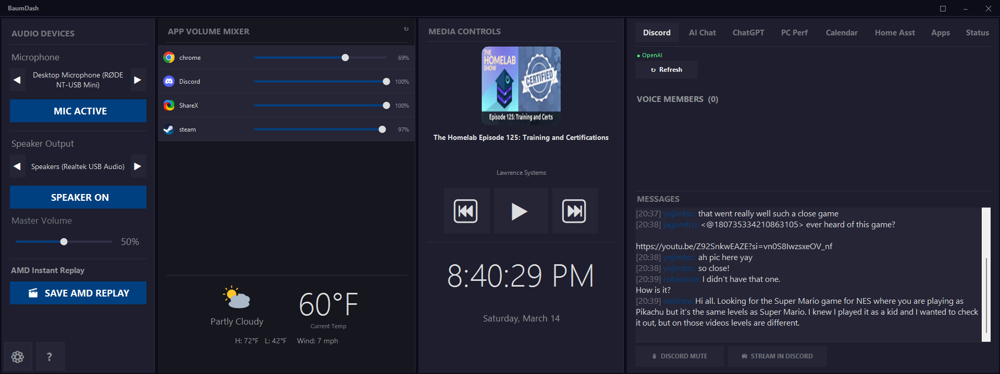

# BaumDash

A personal ultrawide desktop dashboard for Windows. Borderless, dark-themed, always-on-top — built with WinForms and .NET 8.

Designed for a **1920×720 ultrawide monitor**, BaumDash sits at the top or bottom of your screen and gives you a single-glance view of audio, media, calendar, Discord, and system stats — all in one persistent panel.



---

## Layout

BaumDash is a fixed 4-column panel:

| Column | Panel | Width |
|--------|-------|-------|
| 1 | **Audio Devices** | 300 px (320 px on 2560 profile) |
| 2 | **App Volume + Weather** | 500 px (700 px on 2560 profile) |
| 3 | **Media Controls** | 400 px (500 px on 2560 profile) |
| 4 | **Right Panel (tabbed)** | Fills remaining width |

---

## Panels

### Audio Devices
- Switch default **input** (microphone) and **output** (speaker) device with ◀ / ▶ arrows
- **Mic mute** and **Speaker mute** toggle buttons
- **Master volume** slider
- **Instant Replay** button — sends the AMD ReLive (`Ctrl+Shift+S`) or NVIDIA ShadowPlay (`Alt+F10`) hotkey depending on your GPU platform setting

### App Volume
- Scrollable per-app volume sliders with live session icons
- Manual refresh button (↻)
- Auto-refreshes every 5 seconds

### Weather (App Volume footer)
- Current temperature, high/low, wind speed, and condition
- Powered by [Open-Meteo](https://open-meteo.com/) — no API key required
- Updates every 10 minutes

### Media Controls
- Album art, track title, artist
- Previous / Play-Pause / Next buttons
- Live clock (updates every second)
- Works with anything SMTC-aware: Spotify, browsers, Windows Media Player, etc.

### Right Panel — Tabs

The right panel contains 8 tabs. Each tab can be shown or hidden from Settings.

| Tab | What it does |
|-----|-------------|
| **Discord** | Live voice channel member list, mic mute toggle, Go Live button, incoming message feed |
| **AI Chat** | Chat against a local [AnythingLLM](https://anythingllm.com/) workspace with voice input support |
| **ChatGPT** | Chat against OpenAI ChatGPT with voice input support |
| **PC Perf** | Real-time CPU, GPU, RAM, and disk usage metrics |
| **Calendar** | Month calendar grid + upcoming events from any Google Calendar or iCal URL |
| **Home Asst** | Toggle lights and switches, view live sensor readings via Home Assistant |
| **Apps** | Customisable app launcher grid — add any installed app as a tile |
| **Status** | Embedded browser (WebView2) showing any URL — useful for status dashboards |

---

## Features

### System Tray
- Minimises to system tray instead of closing (configurable)
- Right-click tray icon to Show or Exit
- Double-click to restore
- Launch silently to tray with the `--tray` flag

### Auto-Updates
- Checks for updates silently on launch
- Shows an ⬆ Update button when a new version is available
- Downloads and installs automatically, then restarts
- **Stable** channel (default) or **Dev** channel for pre-release builds

### Themes
- **Dark** (default) and **Light** themes
- Custom **accent colour** picker — applied to buttons and highlights across all panels
- Optional **background image** with mode (stretch / fill / fit / tile / centre) and overlay alpha control

### Window Management
- Borderless window with custom title bar drag area
- Window position and size restored on next launch
- Layout profile: **Auto**, **1920×720**, or **2560×720**

### Backup & Restore
- **Export** all settings and API keys to a `.baumdash-backup` file
- **Import** on a new machine to restore everything instantly

### Security
- Discord, ChatGPT, AnythingLLM, and Home Assistant credentials are stored encrypted in `baum-secure.dat` using **Windows DPAPI** — only the current user on this machine can decrypt them
- Non-sensitive settings (URLs, entity IDs, layout preferences) remain in plain JSON for easy manual editing

---

## Requirements

- Windows 10 22621+ (Windows 11 recommended)
- .NET 8 Runtime (bundled — no separate install needed)
- [WebView2 Runtime](https://developer.microsoft.com/microsoft-edge/webview2/) (pre-installed on Windows 11; required for the Status tab)

---

## Installation

Download the latest installer from the [Releases](https://github.com/Bruiserbaum/BaumDash/releases) page and run `BaumDash-Setup-x.x.x.exe`. No admin rights required.

Config template files are placed next to the exe on install. Edit them to enable optional integrations, or configure everything from the **Settings** dialog (⚙ button in the bottom-left of the app).

---

## Configuration

All config lives next to `WinUIAudioMixer.exe`. Use the **Settings** dialog to configure everything — or edit the JSON files directly.

### Settings Dialog

Open with the **⚙** button. Seven tabs:

#### General
| Setting | Description |
|---------|-------------|
| Close to tray | Hide to system tray on close/minimise instead of exiting |
| GPU Platform | AMD or NVIDIA — controls which hotkey the Instant Replay button sends |
| Layout Profile | Auto / 1920×720 / 2560×720 — adjusts column widths |
| Theme | Dark or Light |
| Accent Colour | Custom highlight colour applied across all panels |
| Release Channel | Stable (recommended) or Dev (pre-release builds) |
| Background Image | Optional wallpaper behind all panels with blend mode and opacity |
| Status Page URL | URL displayed in the Status tab |
| Discord Panel Tabs | Show/hide any of the 8 right-panel tabs |

#### Weather
Configure location (latitude/longitude) and unit (°F / °C).

#### Discord
Enter your Discord **Client ID** and **Client Secret** from [discord.com/developers](https://discord.com/developers/applications). A reauthorise button is available if the stored token expires.

#### AnythingLLM
Enter your local AnythingLLM **server URL**, **API key**, and **workspace slug**.

#### ChatGPT
Enter your OpenAI **API key** and preferred **model** (e.g. `gpt-4o`).

#### Home Assistant
Enter your Home Assistant **server URL** and a **long-lived access token**. Add lights, switches, and sensors as `entity_id = Display Name` entries (one per line).

#### Calendar
Add one or more calendars with a **name** and **iCal URL**. Google Calendar iCal URLs are found under Settings → Integrate calendar → *Secret address in iCal format*.

---

## Config Files

| File | Purpose |
|------|---------|
| `general-config.json` | Theme, layout, tray, GPU platform, tab visibility, status URL |
| `weather-config.json` | Latitude, longitude, unit |
| `ha-config.json` | Home Assistant URL, token, lights, switches, sensors |
| `chatgpt-config.json` | OpenAI model |
| `anythingllm-config.json` | Server URL and workspace slug |
| `gcalendar-config.json` | Calendar names and iCal URLs |
| `app-shortcuts.json` | App launcher tile list |
| `baum-secure.dat` | Encrypted credentials (DPAPI — do not share) |
| `window-state.json` | Last window position and size |

### Home Assistant (`ha-config.json`)
```json
{
  "url": "https://your-ha.ui.nabu.casa",
  "token": "YOUR_LONG_LIVED_ACCESS_TOKEN",
  "lights": [
    { "id": "light.living_room", "name": "Living Room" }
  ],
  "switches": [
    { "id": "switch.desk_fan", "name": "Desk Fan" }
  ],
  "sensors": [
    { "id": "sensor.living_room_temperature", "name": "Room Temp" }
  ]
}
```

### Weather (`weather-config.json`)
```json
{
  "latitude": 47.6,
  "longitude": -122.3,
  "unit": "f"
}
```

### Google Calendar (`gcalendar-config.json`)
```json
{
  "calendars": [
    { "name": "Personal", "icalUrl": "https://calendar.google.com/calendar/ical/..." },
    { "name": "Work",     "icalUrl": "https://calendar.google.com/calendar/ical/..." }
  ]
}
```

### ChatGPT (`chatgpt-config.json`)
```json
{
  "apiKey": "sk-...",
  "model": "gpt-4o"
}
```

### AnythingLLM (`anythingllm-config.json`)
```json
{
  "url": "http://localhost:3001",
  "apiKey": "YOUR_API_KEY",
  "workspace": "your-workspace-slug"
}
```

---

## Building from Source

Requires [.NET 8 SDK](https://dotnet.microsoft.com/download/dotnet/8.0) and [Inno Setup 6](https://jrsoftware.org/isinfo.php) (for the installer only).

```bash
# Build
cd WinUIAudioMixer/WinUIAudioMixer
dotnet build

# Run
dotnet run

# Publish self-contained
dotnet publish -c Release -r win-x64 --self-contained true

# Build installer (from WinUIAudioMixer/installer/)
build-installer.bat
```

---

## Architecture

```
WinUIAudioMixer/
├── Controls/           # Owner-drawn WinForms panels (one per dashboard section)
├── Services/           # Audio, Discord, HA, Calendar, Weather, AI, updates, etc.
├── Interop/            # Raw COM interop for Core Audio APIs
├── Models/             # Config record types
├── AppTheme.cs         # Single source of truth for all colours and fonts
└── MainForm.cs         # Root 4-column TableLayoutPanel host
```

All controls are entirely owner-drawn with GDI+ — no external UI libraries. Audio interfaces run on the WinForms STA thread; all change events are marshalled back to the UI via `SynchronizationContext`. SMTC (media session) is initialised asynchronously on `Form.Load`. Credentials are encrypted at rest via Windows DPAPI.

---

## Related Projects

- [BaumLaunch](https://github.com/Bruiserbaum/BaumLaunch) — WinGet-based GUI package manager with system tray integration and setup profiles

---

## License

Personal use. Not currently open for contributions.
